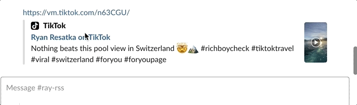
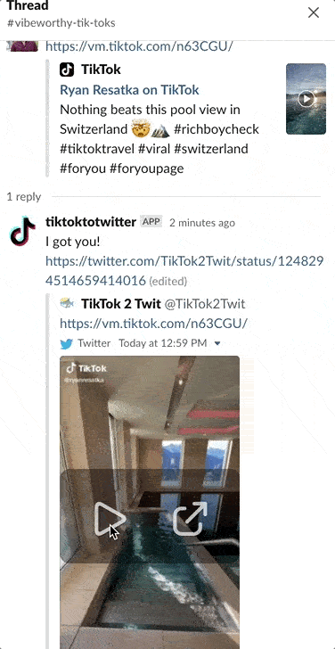
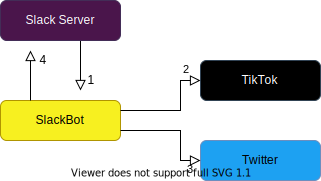

> [!WARNING]  
> I slapped this togther at the peak of the TikTok hype. Now, at the end of 2023, I haven't used it in quite a while and don't know if it works.
> I don't plan to work on this anymore (busy with my master thesis) so I'll archive the repo. Feel free to fork it and use as you wish.

# TikTok to Twitter Slackbot

Wish you could watch TikToks in Slack? Me too. I made a Slackbot fix that by uploading TikToks to Twitter and then posting the Tweets back in a Slack thread.  

---
 1~ Slackbot replies to post:
<kbd>
  
</kbd>

  
2~ You watch TikTok

  
  <kbd>
    
  </kbd>

## Features  
* Works with short and long TikTok urls
* Can handle many concurrent requests
* Unfurls links posted in threads

## How it works  

I hoped to use the [unfurl api](https://api.slack.com/docs/message-link-unfurling) to attach the video. Unforunately, that's not possible and Slack only shows [previews](https://slack.com/help/articles/204399343-Share-links-and-set-preview-preferences) from whitelisted apps. The good news is that Twitter is whitelisted. So we can upload a video to Twitter and then let Slack unfurl that.

I decided not to upload the MP4 directly to Slack because that would hog your Slack storage and litter the files search.

### General Flow:  
Slack -> TikTok -> Twitter -> Slack

1. Recieve a `link_shared` [event](https://api.slack.com/events/link_shared) from Slack for a TikTok
2. Download the MP4 from TikTok
3. Tweet the MP4
4. Reply to original Slack message with Tweet

## Setup 

`cp .env.sample .env` to make the `.env` file.

1. Create a [Twitter developer account](https://developer.twitter.com/en/apply-for-access) and put the credentials to the `.env` file.
2. Create a Slackbot (follow instructions in src/slackbot.js) and put the credentials in the `.env` file.  
3. Run `npm start` 
4. Add your server address to the **Event Subscriptions** page in Slack. ex: `https://example.com/slack/events`  
    * Your bot must be running before you can add the URL
    * You can use ngrok for local testing
    * See [Bolt docs](https://api.slack.com/tutorials/hello-world-bolt) for help setting up a Slackbot.
5. Add the Slackbot to any channel you want it to respond in.

### Hosting  

I recommend hosting for free on [glitch.com](https://glitch.com/). However, Google App Engine or even a Lambda function should work as well.

## Contributing

Feel free to open a PR or create an issue if you'd like to improve the project! 
